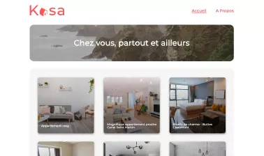

# KASA - Application de location de logements

Ce projet est une application de location de logements.  
Il a été réalisé dans le cadre de la formation de développeur web chez OpenClassrooms.

L'objectif de ce projet : 
- Développer l'ensemble de l'application avec React
- Création de composants React
- Utilisation de React Router pour la navigation
- Utilisation de React Hooks
- Récupération de données depuis un fichier JSON (mise en place dans ce projet de la logique de récupération de données depuis une API)
- Utilisation obligatoire de SASS pour la gestion des styles

## Screenshots

## Scripts disponibles

Dans le répertoire du projet, vous pouvez exécuter les commandes suivantes:

### `yarn install`

Installe toutes les dépendances listées à l'intérieur du fichier package.json dnas le dossier local node_modules (créé automatiquement)

### `yarn start`

Lance l'application en mode développement.\
Ouvrir [http://localhost:3000](http://localhost:3000) pour l'afficher dans le navigateur.

La page se rechargera automatiquement si vous modifiez le code source.\
Vous pourrez également voir les erreurs dans la console.

## Divers

Ce projet a été crée avec [Create React App](https://github.com/facebook/create-react-app).
